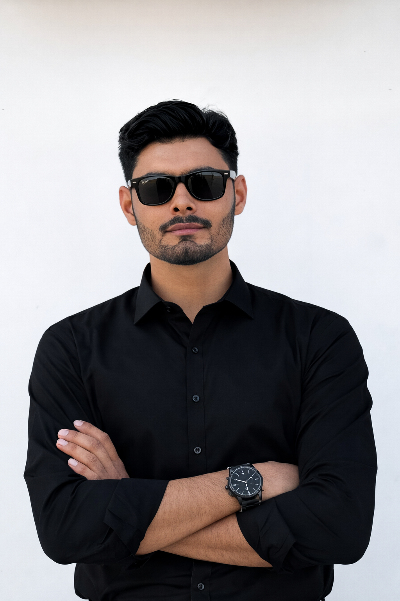

<!DOCTYPE html>
<html lang="en">
<head>
<meta charset="UTF-8">
<meta name="viewport" content="width=device-width, initial-scale=1.0">

<title>Afzal Mughal Portfolio</title>
<link rel="stylesheet" href="https://cdnjs.cloudflare.com/ajax/libs/font-awesome/6.5.0/css/all.min.css">
<link rel="icon" href="https://cdn-icons-png.flaticon.com/512/1055/1055687.png">

</head>

<body>

  
<!-- TikTok Fixed Button -->

<!-- Step 8: WhatsApp fixed -->

<!-- Header -->

  <h1 class="rainbow">Afzal Mughal</h1>
  
Frontend Developer | HTML | CSS

  

<!-- About Me -->

  <h2>About Me</h2>
  
Hello! My name is Afzal Mughal. I am an IT student and I create simple websites.

  
<b>Location:</b> Umerkot, Sindh, Pakistan

  <h2>Contact Me</h2>
  <a href="tel:+923278172478"><button class="btn call">📞 Call Now</button></a>
  <a href="mailto:afzalmughal72478@gmail.com"><button class="btn email">✉️ Send Email</button></a>
  <a href="https://wa.me/923278172478?text=Hello%20Afzal%20Mughal" target="_blank"><button class="btn whats">💬 WhatsApp</button></a>

  <h2>Education</h2>
  
BS Information Technology (3rd Year)

  
Sindh Agriculture University Umerkot Campus

  <h2>Skills</h2>
  

    <h2>My Skills</h2>
    
HTML

    

    
CSS

    

    
Website Design

    

    <h3>☕ Tea Making Skill</h3>
    
Coding + Tea = Productivity ⚡

  

  <h2>Projects</h2>
  <button class="btn call">🌐 Portfolio Website</button>
  <button class="btn email">🍽 Restaurant Website</button>
  <button class="btn whats">📊 Student Record Table</button>

  
🍽 Restaurant Website

  
I created a demo restaurant website for "Al Jannat Hotel Umerkot".

  
📊 Student Record Table

  
I created a student record table design for WhatsApp sharing.

  <h2>Objective</h2>
  
I am looking for opportunities to work as a junior web developer and improve my programming skills.

<!-- Laptop Request -->

  <h2>Student Laptop Request – Developer Proof</h2>
  
My name is <b>Afzal Mughal</b>, a BS IT (3rd Year) student and passionate web developer.

  
Currently I practice coding on mobile using Acode App. A laptop will help me build professional projects.

  
<b>CNIC:</b> 44403-6744740-1

  
<b>University:</b> Sindh Agriculture University Umerkot Campus

  
<b>Program:</b> BS Information Technology

  
<b>Contact:</b> 03278172478

  <a href="https://wa.me/923278172478?text=Hello%20Afzal%20Mughal" target="_blank"><button class="btn whats">Contact on WhatsApp</button></a>
  <a href="cv.pdf" download><button class="btn call">⬇ Download My CV</button></a>
  <a href="https://afzal-mughal.github.io/afzal-website/" target="_blank"><button class="btn call">🌍 View My Website</button></a>

<!-- Footer -->

  
© 2026 Afzal Mughal | Web Developer

  
Made with HTML & CSS on Mobile

</body>
</html>
